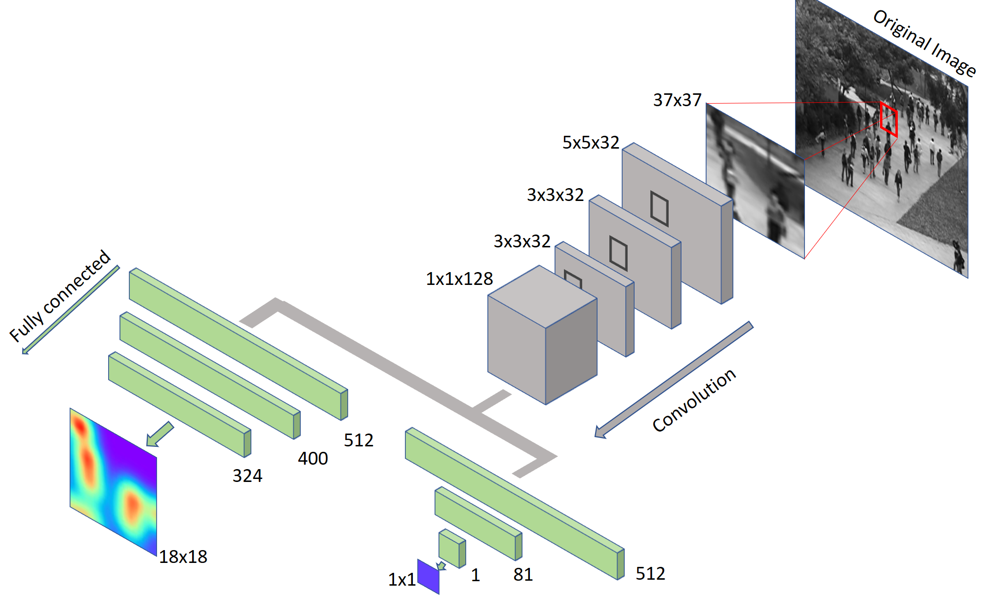

# Object Density Estimation

#### Team Kage

## Introduction

We consider the problem of estimating probabilistic density of objects in images. Given an image, our goal is to recover a density function F as a real function of pixels in the image. Most of the research in the domain are concentrated on the problem of object counting. Although, we aim to address the problem of object counting, we model our problem with preference in preserving the spatial structure of the image. The existing methods focus more on reducing the error in counting and hence, lose the spatial structure of the densities, due to downsample strides in the convolution/pooling operations. By spatial structure, we mean the output of the network is not of same size as the input image, hence there is no 1:1 mapping between the output densities and the input image.

## Preparing Data:
We will talk about how we structure our data as it is important to understand the later sections. First, we have images which has objects of interest. Next, we annotate these objects with a single dot, naturally at its center of mass. We will now fit a probabilistic density on the object, Gaussian density in this case, centered around the dot annotation on the object. Gaussian density makes natural sense because the probability to find the object is more at the center and then decreases as you move away from the objects center of mass. We do this by convolving our dot annotate image with an Guassian kernel of a suitable sigma. The sigma of the density would depend on the spread of the object in the image. We use the image as input and the Guassian convolved density image as ground truth label to learn the mapping between the objects and its distribution.

This is where the concept of object counting comes into the picture. Since, we fit one probability density per object, the sum of all pixels in the density image would be equal to the number of objects in the image. Hence, we formulate our problem based on the estimation of these densities, the accuracy of their peaks, the accuracy of their location and the count metric.

## Problem:
We started our work by understanding the model from [], which we refer to as the Base Model, which has shown state of the art results for many counting datasets. The base model doesn't preserve the spatial structure of the objects in the image. Although, we progressed to build a model which is entirely different than the Base Model, based on our goal and evolution of the project. The base model, like many others in the domain, are optmized for counting performance. They don't preserve the location information of the objects of interest. The base model has 2 pooling layers and the size of output density of the network is reduced by 4. This density is then scaled up to match the dimension of the input patch. These overlapping patched are then averaged over to get the final density map. This resize and average operation of the density patches leads to either damping of the guassian peak, or overestimating the peak, by maintaining the count. This is shown in the figure below. If the Guassian in red is the true guassian, then the estimated density might be any of green, blue or yellow. But, it is important to note that the area under the density is still one and hence it doesn't affect count performance. Another problem is the lose of spatial information of the object because of resize and average operation.

## Approach:
At a high level, we propose a sliding window based approach to address the problem of preserving the spatial structure. Given a image patch, we predict the value of the density at the center of the patch and slide through the image. This approach would predict densities at every pixel in a sliding window fashion, and we stitch all the pixels together to get the final density image. Since, we predict in a pixel wise manner, we don’t need to have skip connection to preserve the spatial information and no information is lost in the intermediate layers. Later, we also show that the output can be generalized to a NxN grid around the center of the patch, to make the density more smooth. All our results were achieved with N=1, ie estimating the density at the center of the patch.

## Network #1: Initial
We start off with a basic model and transit to our final model based on the result of our experiments. Our initial model predicted the density at every pixel in a sliding window fashion. A patch is extracted from the input image and it is fed as input to the network. The size of the image patch we chose is correlated based on the size of the object, whose densities we are trying to estimate. For every image patch, we predict the density of the image patch at the center of the patch. We slide over the image to predict the densities of all the pixels in the image. The size of the image patch was odd since the center is well defined.

### Problems?

## Network #2: Improved
With dual loss function

### Problems?

## Network #3: Final Architecture
Explain nxn smoothing factor, combination of 2 outputs

## Training:
How?

## Testing:
How?

## Iterative Loss switching:
How?

<video id="epoch" src="data/epoch.mp4" controls></video>

## Results

<video id="results" src="data/results.mp4" controls></video>

## Goal?
How was it achieved, explain the weighted density approach. Show good peaks in center approach. Show smoothness in patch

## Perspective Distortion improvement:

## Applications:
Counting, tracking, detection.

## Future research:
Semi supervised, flownet

## Reference:
