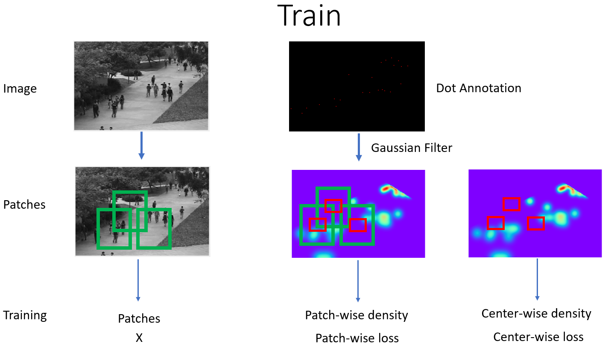

<h1 align="center"><b>Object Density Estimation</b></h1>

<h4 align="center">Deepak GR, Aashish Sood, Akshay Deshpande, Arvind Hudli </h4>

## **Introduction**

We consider the problem of estimating the probabilistic density of objects in images. Given an image, our goal is to recover a density function F as a real function of pixels in the image. Most of the research in the domain is concentrated on the problem of object counting. Although we aim to address the problem of object counting, we model our problem with preference in preserving the spatial structure of the image. The existing methods focus more on reducing the error in counting and hence, lose the spatial structure of the densities, due to downsampling strides in the convolution/pooling operations. By spatial structure, we mean the output of the network is not of the same size as the input image, hence there is no 1:1 mapping between the output density and the input image.  

#### We use dual loss functions to achieve our objective, the two losses are conceptually similar but formulated differently. We also show how an iterative switching of these two similar losses can help train the network to generate better features and lead to better results than having the network trained with just either one of the losses.

## **Preparing Data**
We will talk about how we prepare our data for training as it is important to understand the later sections. First, we have images which have object of interest. Next, we annotate these objects with a single dot, naturally at its center of mass. We then fit a probabilistic density on the object, in this case, Gaussian density, centered around the dot annotation on the object. Gaussian density makes natural sense because the probability to find the object is more at the center and then decreases as you move away from the object's center of mass. We do this by convolving our dot annotated image with a Gaussian kernel of a suitable sigma. The sigma of the density would depend on the spread of the object in the image. We use the image as input and the Gaussian convolved density image as ground truth label to learn the mapping between the objects and its distribution.

 <table style="width:100%">
  <tr>
    <td></td>
    <td></td>

  </tr>
  <tr>
    <td></td>
    <td></td>
  </tr>
</table>  

This is where the concept of object counting comes into the picture. Since we fit probability density on an object, the sum of all pixels in the density image would be equal to the number of objects in the image. Hence, we formulate our problem on the estimation of these densities, the accuracy of their peaks, the accuracy of their location and the count metric.

## **Problem Statement**
We started our work by understanding the model from [2], which we refer to as the Base Model, which has shown state of the art results for many object counting datasets. The base model doesn't preserve the spatial structure of the objects in the image. We progressed to build a model which is entirely different than the base model, based on our goal and evolution of the project. The base model, like many others in the domain, is optimized for counting performance. They don't preserve the location information of the objects of interest. The base model has 2 pooling layers and the size of output density of the network is reduced by 4. This density is then scaled up to match the dimension of the input patch. These overlapping patched are then averaged over to get the final density map.

#### The resize and average operation of the density patches leads to either damping of the gaussian peak, or overestimating the peak, but by maintaining the count. This is shown in the figure below. If the gaussian in red is the true gaussian, then the estimated density might be any of green, blue or yellow. But, it is important to note that the area under the density is still one and hence it doesn't affect count performance. Another problem is the loss of spatial information of the object because of resize and average operation.

## **Our Approach**
At a high level, we propose a sliding window based approach to address the problem of preserving the spatial structure. Given an image patch, we predict the value of the density at the center of the patch and slide through the image. This approach would predict densities at every pixel in a sliding window fashion, and we stitch all the pixels together to get the final density image. Since we predict in a pixel wise manner, we don’t need to have skip branches to preserve the spatial information and no information is lost in the intermediate layers. Later, we also show that the output can be generalized to a n x n grid around the center of the patch, to make the density more smooth. All our results were achieved with n=1, ie estimating the density at the center of the patch.
We consider UCSD Pedestrian dataset and our object of interest are the people walking on the walkway.

## **Network #1: Our First model**
We start off with a basic sliding window model and transitioned to our final model based on the result of our experiments. Our initial model predicts the density at every pixel in a sliding window fashion. A patch is extracted from the input image and it is fed as input to the network. The size of the image patch is chosen based on the size of the object, whose densities we are trying to estimate. For every image patch, we predict the density of the image patch at the center of the patch. We slide over the image to predict the densities of all the pixels in the image. The size of the image patch was odd since the center is well defined.

### **First model shortcomings**
Although the model looks simple, it was very hard to train. Consider the following samples,

In the above samples, there are people in the patch, but the density at the center is zero. The network would learn the object density model only if the object is at the center of the patch. Since, more than 80% of the pixels in the image belong to the background, a random sampling of patches in the image during training would result in the network learning more of the background density than the object of interest, which is not what we want. This shows us that, even though we would like to estimate local density at the center, we also need to take into account the global density of the patch. This calls for a dual loss approach, one loss takes care of global density and another loss takes care of localized density, ie density at the center.

## **Network #2: Improved**
In this improved network, we optimize 2 losses. One for the global density of the patch itself and another one for the local density of the patch at its center. Given a patch, we estimate the density of the whole patch to a size 18x18, we call this patch-wise density. The other fully-connected path in the network estimates the density at the center, we call this center-wise density. The patch-wise loss trains our the network to extract better features and its fc layers perform the final estimation. This network improved our results but still had its shortcomings. We discuss them in the next section.

  

### **Improved model shortcomings**
We employed 2 different approaches to minimizing the dual losses.

#### **Iterative loss switching**
In this method, during training, the losses were iteratively switched every 't' iterations. Even for different values for 't', both losses continued to fight each other and didn't converge. By convergence, we mean to say that while one loss was being minimized the other one increased and this happened continuously during training.

#### **Combined loss training**
Here, both losses were combined using a weighted sum. Since, the output is a probability density value, we deal with losses which are very low to start with. Since the patch-wise loss takes in 18x18 patch, the corresponding loss is higher than the center-wise loss which is just a L2 norm of the predicted center density and center ground truth density, which is orders less than the patch-wise loss. This results in having the network minimize the patch-wise loss more than the center-wise loss, which is not desired. It's the minimization of the center-wise loss that gives us accurate peaks and spatial location. Although scaling center-wise loss improved the situation, the scale value had to be large and it didn't make it robust enough for other datasets. Model trained with this performed badly on frames where there were high number objects with high overlap between them.

In general, what was observed was that both losses tried to undo each other in every epoch and didn't converge. We noticed that the shared fc layers might be getting undone by each loss. Hence, we tried with having separate fc layers for each losses, so that they don't interfere with each other and also converge. This lead to our next and final model.

## **Network #3: Final Architecture**
The output of the features extraction Convolution layers are fed to separate fc layers for both losses. This ensures that the fc layers of 2 losses are trained separately and help achieve convergence. We train our network with iterative loss switching approach, we switch losses every 3 iterations. We will show later how this helps our losses to converge. The patch-wise loss trains convolution layers to extract global patch features, while the center-wise loss helps extract the local feature at the center. The separate fc layers then help in predicting the density.

## **Training**

Patches of size 37x37 are densely extracted from the image. The dot annotated image is convolved using a Gaussian kernel. This can be any probability density function, even sum of two densities, as long as they are normalized such that the integration of all density values of any object equals to one. The density patches corresponding to the image patches are then extracted from the density image (shown in green boxes). Since, we have two loss functions, the center pixel of these density patches are also extracted to train center-wise loss (shown in red). Later we show how we can extract any nxn grid around the center depending on how smooth we want our estimation to be by sacrificing peak accuracy.

## **Training with Dual Loss**

  
We have two loss functions. They are minimized in an iterative fashion by switching the losses every 3 iterations (empirically chosen). We kick start the training with the patch-wise loss, to train the model to learn the global density in the patch and then switch to localized center density after 3 iterations, and iterate.

Here, we show the evolution of the predicted density with epochs. As mentioned before, training is kickstarted with patch-wise loss and hence you can see the structure emerging on the patch-wise predicted density after the first epoch. This continues to evolve until 3 iterations. Even though the center-wise loss has not been trained yet, you can still see some minute structure emerging from the center-wise predicted density. At epoch 3, once the training starts minimizing center-wise loss, the predicted density structure gets more clear. This continues for 30 epochs.

      

Below is the video showing the evolution for the whole 30 epochs. You can notice how the counting error keeps flipping based on which loss was being trained, as the losses fight it out. But, later the model converges to a stable training error. This is where the separate fc layers for each loss help. They help reduce the influence of the one loss over the other. This method works because both losses are correlated in some way, i.e. they are sort of achieving the same thing in a different way. Hence, the network learns that there is way to minimize both the losses without clashing.  

<h4 align="center"><b>Dual loss convergence (Video)</b></h4>
<iframe width="740" height="569" src="https://www.youtube.com/embed/QH7FkekYk2M?rel=0&amp;showinfo=0" frameborder="0" gesture="media" allowfullscreen=""></iframe>
<!--
<video id="epoch" height="auto" width="738" src="data/epoch.mp4" controls onclick="this.paused ? this.play() : this.pause();"></video>
-->

## **Testing**
During testing, we extract patches of the same size of 37x37 in a sliding window fashion. These patches are then inputted to the network and predict both the global density and local center density. The global patch density, which is of 18x18 is resized to input size and averaged over all overlapping density patches to get final density image. But, there is no resizing involved with the center-wise predicted density. Since, the density is predicted at every pixel, the size of the final density image is of the same size as the original image. Hence, our method outputs 2 density images for the whole test image, one with patch-wise density and then the other with center-wise density.  

## **Results**

Below video showcases the performance of our model in comparison with the base model from [2]. We present brief detail in the later section. The weighted density in the last column is the weighted sum of patch-wise and center-wise density, with higher weight to the center-wise density. This was done to make the center-wise density more smooth. Although the center-wise density is the one which has accurate peaks and preserves spatial information, achieves the best results on UCSD maximal test dataset.
<h4 align="center"><b>Result Summary (Video)</b></h4>      
<iframe width="740" height="592" src="https://www.youtube.com/embed/FVwy_JU3vbA?rel=0&amp;showinfo=0" frameborder="0" gesture="media" allowfullscreen></iframe>
<!--
<video id="results" height="auto" width="738" src="data/results.mp4" controls onclick="this.paused ? this.play() : this.pause();"></video>
-->

**NOTE**  

  1. The above results were achieved on UCSD maximal test dataset. Trained with frames 600:5:1400 and test data was same as mentioned in [2]  

  2. Because of the sliding window approach, 18 pixels (half of patch size) were skipped around the border. The only count it would miss are the ones entering the frame in the bottom-left corner of the screen. The ground truth numbers were adjusted accordingly to ensure fair comparison. This needs to be fixed, but shouldn't cause our error to increase too much.  

  3. All the other methods mentioned in the table above test their model on a varied set of datasets. We limited our experiments to UCSD pedestrian dataset, and above listed comparison are for the same dataset. The performance of our model for other datasets still remains to be experimented.

## **Analysis**

From the below picture, it can be seen that the patch-wise density is more smooth but has inaccurate peaks due to resize and averaging patch densities. The center-wise density is more rough, but the peaks closely resemble the ones from ground truth density, it also preserves the location to acceptable accuracy. The weighted density is just a smoother version of center-wise density. It is obtained by weighted average of patch-wise and center-wise density, with the latter having more weight. This is one of the attempt to make use of both densities. Estimating the center-wise density of the whole image is much faster than estimating its patch-wise density.  

  

Below, we show a frame from the results video. You can notice the following,  
  **Base Model Density** [2]: Too many false peaks around the area where there are too many people. Too many such peaks causes the count to overshoot.  
  **Patch-wise Density**: The effect of the false peaks are reduced, but they still exist. Very difficult to find individual peaks near the overlapping regions.  
  **Center-wise Density**: Performs the best, peaks closely match that of ground truth density. The boundaries around the object are more predominant compared to all other methods.  

  

Here we present a more generalized center-wise density prediction model. We don't just predict the density at the center, but also for n x n grid around the center. This makes the density more smooth with tradeoffs with peak accuracy. Detailed results of this model is yet to be obtained. Only preliminary analysis are currently done.  

  

## **Perspective Distortion improvement**

In the following section, we explain the problem of perspective distortion in the video data set. Topics presented here is completely based on the work in [2]. We just present here why their method works and how our model can be tuned to make use of it.  

If you remember, at the beginning we mentioned about convolving the dot annotations with a Gaussian kernel. The problem here is that the width of the Gaussian to be used depends on how far the object of interest is from the camera. For instance, in the below picture, two people marked in red box are to be convolved with Gaussians of different widths, because one of them is near to the camera hence looks bigger than the other. In all our experiments until now, we used a perspective map provided by the dataset which provides a distance map of all the pixels from the camera. We used this information to adjust the scale of our Gaussian while convolving the dot annotated images.  

  

[2] proposed a method of multi-scale approach which doesn't require the perspective map. In this, the image patches are cropped at different scales and are then rescaled to the original patch size. All these scaled patches are passed on to their corresponding convolution layers for feature extraction and are then combined through fc layers for estimation. The flattening of the multi-scale features on to common fc layers works because they all share the same ground truth density. This method works because of the fact that the center of mass, center of gaussian, is always accurate even with perspectively distorted objects. The probability of finding the object is more at the center and reduces as we move away. This multi-scale approach ensures that the center part of the patch, which is less prone to perspective distortion is given more preference while training than the other regions of the object.  

We adopted this approach and implemented it on our model. Our modified model for multi-scale approach looks like below. The initial results look encouraging for a setup without the perspective map, but a detailed analysis has not been done to present the results.  

## **Applications**  

As we already mentioned before, since the object density sum to one, integration of all density values in the image equals to the overall object count in the image.  

  

Our goal of estimating accurate peaks and preserving spatial information will useful for Object Detection and Object Tracking.

## **Reference**

[1] Victor Lempitsky and Andrew Zisserman. Learning To Count Objects in Images. Advances in Neural Information Processing Systems, 2010.  
[2] Daniel O ̃noro-Rubio and Roberto J. L ́opez-Sastre. Towards perspective-free object counting with deep learning. ECCV, 2016.  
[3] Cong Zhang, Hongsheng Li, Xiaogang Wang, Xiaokang Yang. Cross-scene Crowd Counting via Deep Convolutional Neural Networks. CVPR, 2015.  
[4] Di Kang, Zheng Ma, Antoni B. Chan. Beyond Counting: Comparisons of Density Maps for Crowd Analysis Tasks - Counting, Detection, and Tracking. arXiv 2017.  
[5] Lokesh Boominathan, Srinivas S S Kruthiventi, R. Venkatesh Babu. CrowdNet: A Deep Convolutional Network for Dense Crowd Counting. ACM, 2016.  
[6] Mark Marsden, Kevin McGuinness, Suzanne Little and Noel E. O’Connor. Fully Convolutional Crowd Counting On Highly Congested Scenes. arXiv, 2016.  
[7] Lingke Zeng, Xiangmin Xu, Bolun Cai, Suo Qiu, Tong Zhang. Multi-scale Convolutional Neural Networks for Crowd Counting. arXiv, 2017.  
[8] Guanbin Li, Yizhou Yu. Visual Saliency Based on Multiscale Deep Features. arXiv, 2015.  
